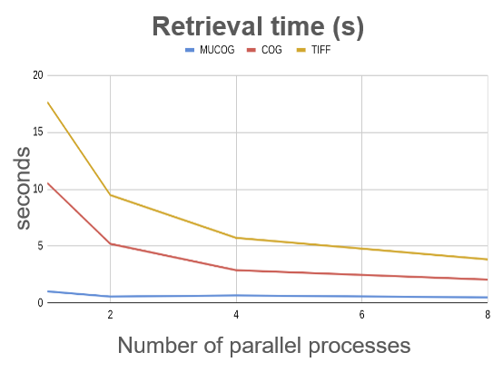

#
## Multidataset COG (MuCOG)

The Geocube can refactor the data to store several images in an optimized version of the COG.

The COG is already an optimized Geotiff for the cloud, thanks to its internal organization of the file. The data is split into tiles and the index are grouped together.

The Multidataset COG, the MuCOG, goes one step further. It interlaces the full resolution blocks of several cogs, enabling a fast access to the whole timeserie of a given block. As in the COG, this interlacing preserves sparsity. Overviews can be stored spatially contiguously or interlaced, depending on the use case. This MuCOG respects the GeoTIFF standard that makes it readable by GDAL.

## Performance

The MuCOG is not mandatory, but it gives very good performance when it comes to reading a timeseries on a cloud storage.
The MuCOG minimizes the latency, by drastically decreasing the number of calls to the storage, it reduces bandwidth usage, by decreasing the volume of data read and it results in a reduction of costs, with a lower computing requirement. With a MuCOG, you can retrieve a block of one hundred images in less than a second, which is 10 to 20 times faster than with COGs.

**Read a timeseries on a cloud storage – 100 datasets, 256x256 pixels**

Test condition :

- Virtual machine on GCP (16CPU/64Gb RAM)
- Storage on GCS
- Request of 100 blocks (256px*256px)

  
  
  

## Consolidation

Consolidation is the process (called `job`) consisting in translating, warping, splitting, merging multiple files into COGs or MuCOGs, given a grid layout.

It's a long process (from a couple of minutes to an hour) that requires a rigorous management of the life-cycle of the files. It can fail, be restarted or cancelled. The consolidation steps are handled by a state machine and as far as possible, the states can be retried, cancelled or revert.

More information on how to consolidate [here](../user-guide/consolidation.md).

The `API Server` handles the life-cycle of the `job` but the creation of the MuCOGs is done by the `Consolidation workers` in parallel, autoscaled by the `Autoscaler`.

  

The consolidation worker first creates a COG for each record from the images linked to the record being processed, then it creates a MuCOG, merging the COGs together in a unique file.

At the end of the consolidation, original files are removed from the index and deleted by another state machine:  

  

More information on deletion [here](../user-guide/deletion.md).
