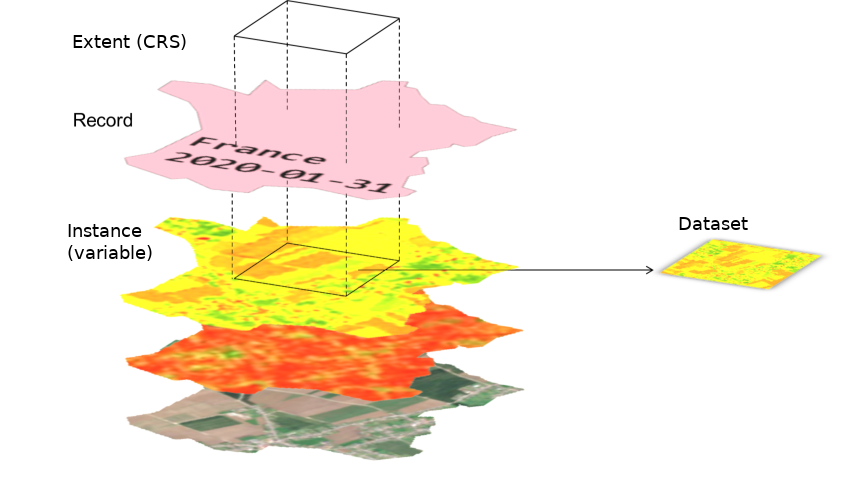

# Entities

In the Geocube, an image (a [dataset](#dataset)) is indexed by a [record](#record) and an [instance](#instance) of a [variable](#variable). In short, a record defines the data-take and the variable defines the kind of data.



## Record

A record defines a data-take by its geometry, its sensing time and user-defined tags that describe the context in more detail. A record is usually linked to an image of a satellite. For example, the image taken by Sentinel-2A over the 31TDL MGRS tile on the 1st of April 2018 is described by the record:

- **Name**: S2A_MSIL1C_20180401T105031_N0206_R051_T31TDL_20180401T144530
- **AOI** : 31TDL tile *(POLYGON ((2.6859855651855 45.680294036865, 2.811126708984324 45.680294036865, 2.811126708984324 45.59909820556617, 2.6859855651855 45.59909820556617, 2.6859855651855 45.680294036865)))*
- **DateTime** : 2018-04-01 10:50:31
- **Tags** :
    - [**CONSTELLATION**: "SENTINEL2"]
    - [...]

But a record can describe any product like a mosaic over a country, a classification map... :

- **Name**: Mosaic of France January 2020
- **AOI** : France
- **DateTime** : 2020-01-31 00:00:00
- **Tags**:
    - [**PROCESSOR**: Software used to process the mosaic]
    - [...]

Records are uniquely defined by :

- its name
- its tags : user-defined depending on the project (currently, no standard is implemented).
- its date

So, it's possible to have two records with the same name, but with different tags.

### AOI
A record is linked to an AOI in geographic coordinates. The AOI can be shared between several records. It is used to filter records by localisation.

## Variable

A variable describes the kind of data stored in a product, for example _a spectral band, NDVI, RGB, backscatter, classification_...

It stores the information needed to **describe**, **process** and **visualize** the product.

In particular, the variable describes a data format with:

- a data-type (`int`, `float`, `complex`, `byte`...): what type of data this variable describes ?
- a minimum value, or if the variable is unbound, a lower reference (see )
- a maximum value, or if the variable is unbound, a upper reference
- a no-data value

This dataformat is used to render images. A request of images will cast the data according to this format (see [Dataset dataformat](#dataformat))

### Instance

An instance is a declination of a variable with different processing parameters.

For example, an RGB variable can be defined with different spectral bands (RGB bands of Sentinel-2 are not the same as LANDSAT's), a Label variable can have a different mapping, the SAR products can be processed with different processing graphs or software, but, in each example, the declination belongs to the same variable.

Instances have user-defined metadata that can be used to describe them. For example, the metadata can describe:

- The processing parameters used to compute the images indexed with this instance
- A description of the classes or the number of the classes for a Label variable.
- The resolution
- ...

```python
client.variable("RGB").instantiate(name="Sentinel2-Raw-Bands", metadata={"R":"664.6", "G":...})
client.variable("LandUseLabels").instantiate(name="v1", metadata={"0":"Undefined","1":"Urban", "2":...})
client.variable("Sigma0VV").instantiate(name="terrain-corrected", metadata={"snap_graph_name":"mygraph.xml", ...})
```

### Palette

For color rendering, a variable can defined a palette. A palette is described by a set of values in [0, 255] and its corresponding RGB-points. All the values that are not declared are linearly interpolated.

## Container

A `container` describes a file image, with its full path, its storage class (when the image is stored in an object storage) and a flag to tell whether the Geocube is responsible for the life-cycle of this file (in other words, should the Geocube delete the file or not if it's dereferenced ?).

A container can contain one or several `dataset`.

### Dataset

A dataset is defined by the following information: 

- which band(s) of the `container` are indexed (usually all the bands, but it can be a subset of the bands of the image, e.g. only one band of a 3-bands images)
- the dataformat of the pixels (datatype, min, max and no_data value)
- how to map its pixel values to the dataformat of the variable (min->minOut, max->maxOut and exponent)

A dataset is indexed by a `record` (to find it semantically, geographically and temporally) and the `instance` of a `variable` (to find it by type of data).

### Dataformat and mapping

In the Geocube Database, the (internal) `data format` of an `dataset` can be different from the `data format` of the `variable` that describes the image (for example: in order to optimize storage costs, the image may be stored in byte whereas the variable describes a float value between 0 and 1). When the data is retrieved, the Geocube maps the internal format of the dataset to the data format of the variable. This process may map the data below the minimum or above the maximum value. In that case, no crop is performed.

Usually, the `min` value of the dataformat of the dataset will be mapped to the `min` value of the dataformat of the variable, and the same for `max` (in that case, `minout` and `maxout` are equals to `min` and `max` of the dataformat of the variable).

In some cases, it could be useful to map the `min/max` values of the dataformat of the dataset to other values than the `min/max` of the variable. In that case, the `minout/maxout` are defined differently from the `min/max` of the variable, and `min/max` value of the dataformat of the dataset will be mapped to the `minout/maxout`.

The generic case is described here :


NB:

- **`dataset.min` and `dataset.max` are NOT necessarily the minimum and maximum values of the pixels but the values that map the min and max of the variable.**
- DataFormat is provided for the interpretation of the image. There is no check during indexation that the min, max and no_data value are the right ones.

## Job

A modification of the life-cycle of the datasets and the underlying images is a process described by a state-machine, that can be run step-by-step, cancelled, retried, ...

A `job` is an entity that describes this running process, and especially the current state in the whole state machine. A `job` has, in particular :

- a name
- a type of action (Consolidation, Deletion, Moving...)
- a status to decribe the progress, the current state (Initialisation, In progress, Done, Effective, Failed, Cancelled, Aborted...)
- a payload to describe what to do
- a list of datasets that are locked during the process
- a list of subtasks
- logs and other information to monitore the processus

A job can be executed in many ways:

- Step-by-step: the state-machine will stop after the state changes and before executing the actions linked to this state. It's useful to monitore the job. Three levels exist: stop at all states, only major states or only critical states.
- Synchronous: the state-machine will process all the states in a row (the execution returns when the job is finished)
- Asynchronous: same as Synchronous but in background (the execution returns immediately, the job continue in background)

## Layout 

A `layout` describes how the data is spatially organised. It is composed of an external layout (typically a `grid` of cells) and an internal layout describing the data in each cell (size of the blocks of data and depth).

A `layout` is used:

- to optimize the storage of the datasets (see [Consolidation](consolidation.md)). Each cell of the grid is a file containing several datasets (max depth) that are tiled according to the block size.
- to tile an AOI and divide a processing into multiple subtasks

### Grid

A `grid` is a set of `cells` with a name and a description. Each `cell` is a polygon in a given CRS with a unique ID in a given grid.

For example,

Three type of grids are currently available in the Geocube:

- Regular grid: all the cells have the same rectangular size and pave the AOI in a unique CRS.
- Single cell grid: a grid of one rectangular cell in a given CRS. The bounds of this cell is defined on the fly, depending on the usage.
- Customer-defined grid: each cell is defined independently from the others, with a LinearRing and a CRS, and eventually, an internal regular grid. The [MGRS](https://en.wikipedia.org/wiki/Military_Grid_Reference_System) can be described by a `grid`.
