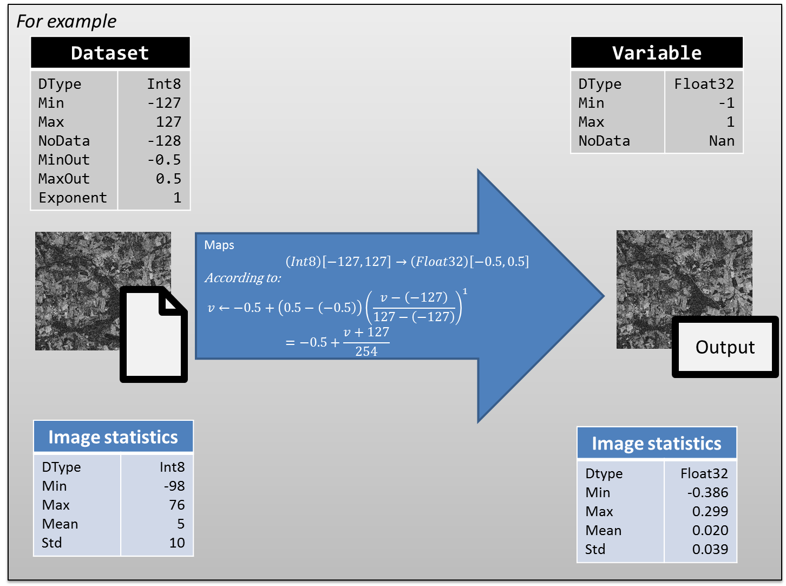

# Indexation

## Description

Referencing a new image in the Geocube is a process called **indexation**. The Geocube does not store images (it's the purpose of the object storage), but their URI and some metadata on them. 

The indexation ([IndexDatasets()](grpc.md#indexdatasetsrequest)) defines :

- how the geocube will read an image:
    - Which layer of the image ? (in case of multiple layers are stored in the image)
    - Which band(s) ?
    - How to interpret pixel values ? (see [dataformat](entities.md#dataformat-and-mapping))
- how the client will find the dataset:
    - geographically, temporally and semantically, using the [record](entities.md#record)
    - by the type of data, using the[instance](entities.md#instance) and the [variable](entities.md#variable)

NB:

- Geocube must have the rights to access the images. 
- During the indexation, the file containing the image is not modified in any way. It's only the way the geocube will interpret the image that is defined.
- All the information provided during indexation are for the interpretation of the image. There is no (or limited) check during indexation that the user provides the right values. 

## Storage optimisation
In order to optimize the storage of a large volume of data, it can be decided to reduce the size of the data type (for example from float32 to int16) and/or scale the data.

So, the dataformat of the dataset can be different from the variable in some ways:

- **For compression purpose** :
     - the data type is smaller. For example data is encoded in byte [0, 255] that maps to float [0, 1] in the variable.
- **To optimize accuracy** : the range of values is smaller than the one of the variable. Two examples :
     - Given a variable between -1 and 1, the data in a given image is known to be in [0, 1] instead of [-1, 1]. To optimize accuracy, the data is encoded between 0 and 255 and min/max_out are [0, 1].
     - Given a variable between 0 and 100, 90% of the data is known to be between 0 and 10. To optimize accuracy, the data is encoded between 0 and 255, using a non-linear mapping to [0, 100] using an exponent=2. Data is scaled according to the non-linear scaling in the [diagram](#diagram):

